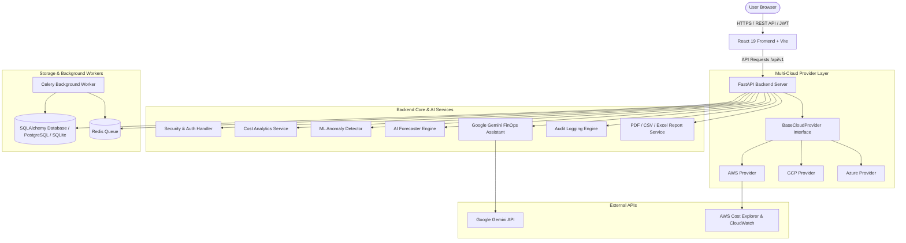

# ☁️ CloudWise AI — Enterprise Cloud Cost Optimizer & FinOps Platform

[](#)
[](#)
[](https://www.python.org/)
[](https://fastapi.tiangolo.com/)
[](https://ai.google.dev/)
[](https://react.dev/)
[](https://www.typescriptlang.org/)
[](LICENSE)

CloudWise AI is an enterprise-grade cloud cost optimization, rightsizing, and FinOps platform designed to monitor, analyze, forecast, and optimize multi-cloud infrastructure spending (AWS, GCP, Azure). It combines machine learning models (Isolation Forest) for automated anomaly detection, Google Gemini API for natural-language FinOps assistance, and robust rightsizing engines for compute, database, and storage assets.

---

## 🌟 Core Capabilities

- **Executive FinOps Dashboard**: Real-time Key Performance Indicators (KPIs), spend velocity metrics, month-to-date (MTD) tracking, budget health indicators, and interactive trend charts.
- **High-Performance Caching & Parallel API Layer**: Custom in-memory credentials caching (`STSConnectionCache`) to prevent repeated AssumeRole requests, thread-safe endpoint response caching (`InMemoryCache`), and concurrent AWS API parallel execution via `ThreadPoolExecutor` (cutting metrics loading time from 5x sequential latency to 1x parallel latency).
- **Demo Mode Isolation Engine**: Automated database-level identification (`is_demo` flag in `AWSAccount`) ensuring seeded mock cost data behaves completely independently of real user-connected AWS integrations, preventing STS timeouts and credentials friction.
- **Multi-Cloud Architecture**: Modular cloud provider interfaces (`app/providers/`) supporting AWS, Google Cloud Platform (GCP), and Microsoft Azure integrations.
- **Granular Cost Analytics**: Multi-dimensional cost breakdown by cloud services, regions, accounts, and dates with stacked bar charts and comparison tables.
- **ML Anomaly Detection**: Built-in machine learning module using Isolation Forest algorithms to detect cost spikes or drops, scoring severities (critical, high, medium, low) with automated root-cause analysis.
- **Google Gemini FinOps Assistant**: Conversational AI assistant powered by Google Gemini API (`gemini-3.5-flash`) for explaining billing anomalies, rightsizing tips, and spending predictions.
- **Automated Resource Rightsizing**: Intelligent recommendation engine for EC2 compute sizing, RDS database optimization, S3 lifecycle storage management, Spot Instance opportunities, and Savings Plans.
- **Multi-Threshold Budgeting**: Real-time budget monitoring supporting granular threshold notifications (50%, 80%, 90%, 100%) with status indicators.
- **Multi-Format Report Exports**: On-demand generation and instant download of formatted executive PDF summaries, CSV financial records, and Excel (`xlsx`) reports.
- **Audit Logging & Governance**: Complete audit trail API (`/api/v1/audit-logs`) tracking security events, administrative changes, authentication flows, and budget creations.
- **Enterprise Security**: Role-based access control (RBAC), multi-tenant organization isolation, security headers, rate limiting, and zero hardcoded credentials.

---

## 🏗️ System Architecture

CloudWise AI is structured as a decoupled full-stack application featuring a FastAPI backend, React/TypeScript SPA frontend, PostgreSQL/SQLite data store, and Celery/Redis task distribution.



---

## 🛠️ Tech Stack

| Component | Technologies |
|---|---|
| **Frontend Core** | React 19, TypeScript 6.0, Vite 8.0, Zustand, Axios |
| **Frontend Styling** | Vanilla CSS Design System, Tailwind CSS 4.0, Lucide Icons, Framer Motion 12.0 |
| **Data Visualization** | Recharts 3.8, Three.js / React Three Fiber |
| **Backend Core** | Python 3.11+, FastAPI 0.115, Pydantic v2, PyJWT, Passlib (bcrypt) |
| **Database & Async** | SQLAlchemy 2.0 (ORM), Alembic (Migrations), Celery 5.4, Redis 7.0 |
| **AI / Machine Learning** | Google Gemini API (`gemini-3.5-flash`), scikit-learn (Isolation Forest) |
| **Document Engine** | ReportLab (PDF), openpyxl / csv (Excel & CSV exports), Jinja2 |
| **DevOps & Security** | Docker, Docker Compose, Nginx, Security Headers, Rate Limiting |

---

## 📁 Folder Structure

```
Cloud Wise/
├── backend/
│   ├── app/
│   │   ├── ai/                 # Anomaly detection, time-series forecaster, Gemini AI Assistant
│   │   ├── api/                # Versioned API routes (/api/v1/)
│   │   │   └── v1/             # Endpoints (auth, costs, budgets, anomalies, forecasts, audit-logs, etc.)
│   │   ├── core/               # App configuration, security headers, logging, rate limiting
│   │   ├── models/             # SQLAlchemy ORM models (User, Org, Budget, AuditLog, etc.)
│   │   ├── providers/          # Multi-cloud provider abstraction layer (AWS, GCP, Azure)
│   │   ├── repositories/       # Data access repositories
│   │   ├── schemas/            # Pydantic validation schemas
│   │   ├── services/           # Core business logic services (Cost, Budget, Report, Recommendation)
│   │   ├── tasks/              # Celery background periodic jobs
│   │   ├── database.py         # SQLAlchemy engine & session management with auto-migrations
│   │   └── main.py             # FastAPI app factory and middleware
│   ├── alembic/                # Database migration scripts
│   ├── static/                 # Storage for generated reports
│   ├── test_endpoints.py       # Automated E2E verification test suite
│   ├── requirements.txt        # Backend dependencies
│   └── Dockerfile              # Container definition for backend
├── frontend/
│   ├── src/
│   │   ├── components/         # UI primitives, layout wrappers, 3D R3F canvas
│   │   ├── pages/              # Page views (Dashboard, Analytics, Budgets, Reports, etc.)
│   │   ├── services/           # Axios API client bindings
│   │   ├── store/              # Zustand global application state
│   │   ├── index.css           # Design system tokens and custom utilities
│   │   └── App.tsx             # Main application router
│   ├── package.json            # Frontend package manifest
│   └── Dockerfile              # Multi-stage Nginx container definition
├── docker-compose.yml          # Container orchestration manifest
├── .env.example                # Environment configuration template
├── PROJECT_INPUTS_REQUIRED.md  # Missing production credentials guide
└── README.md                   # Project documentation
```

---

## 🔐 AWS IAM Permissions Required

CloudWise AI follows the Principle of Least Privilege (PoLP) and operates using strictly read-only IAM policies.

```json
{
  "Version": "2012-10-17",
  "Statement": [
    {
      "Sid": "CloudWiseCostExplorerAccess",
      "Effect": "Allow",
      "Action": [
        "ce:GetCostAndUsage",
        "ce:GetCostForecast",
        "ce:GetDimensionValues",
        "ce:GetReservationUtilization",
        "ce:GetSavingsPlansUtilization"
      ],
      "Resource": "*"
    },
    {
      "Sid": "CloudWiseReadOnlyInventory",
      "Effect": "Allow",
      "Action": [
        "ec2:DescribeInstances",
        "ec2:DescribeVolumes",
        "rds:DescribeDBInstances",
        "s3:ListAllMyBuckets",
        "cloudwatch:GetMetricData"
      ],
      "Resource": "*"
    }
  ]
}
```

> [!NOTE]
> **AWS Academy Learner Lab Note**: Permanent IAM user creation is restricted in AWS Academy sessions (`voclabs` role). Configure temporary credentials (`AWS_ACCESS_KEY_ID`, `AWS_SECRET_ACCESS_KEY`, and `AWS_SESSION_TOKEN`) in `.env`.

---

## 🤖 Google Gemini AI Setup

CloudWise AI uses Google Gemini API for FinOps billing analysis. To configure:

1. Obtain an API key from [Google AI Studio](https://aistudio.google.com/).
2. Set the environment variable in `.env`:
   ```bash
   GEMINI_API_KEY="AIzaSy..."
   GEMINI_MODEL="gemini-3.5-flash"
   ```

---

## 🚀 Quickstart & Local Development

### 1. Clone & Environment Setup
```bash
git clone https://github.com/bharats487/cloud-cost-optimizer.git
cd "Cloud Wise"

cp .env.example .env
cp .env.example backend/.env
```

### 2. Backend Setup
```bash
cd backend
python -m venv .venv

# On Windows:
.venv\Scripts\activate
# On Linux/macOS:
source .venv/bin/activate

pip install -r requirements.txt
# Run database migrations
alembic upgrade head
uvicorn app.main:app --reload --port 8000
```
Backend API will be live at `http://127.0.0.1:8000` (Docs at `http://127.0.0.1:8000/docs`).

### 3. Frontend Setup
```bash
cd ../frontend
npm install
npm run dev
```
Frontend application will be live at `http://localhost:5173`.

---

## 🐳 Docker Deployment

Launch the complete application stack (Backend, Frontend, Celery Worker, Redis) with Docker Compose:

```bash
docker-compose up --build -d
```
- **Frontend App**: `http://localhost:80`
- **Backend API**: `http://localhost:8000`
- **API Documentation**: `http://localhost:8000/docs`

---

## 🧪 Verification Suite

Run the automated E2E verification suite against the backend:
```bash
cd backend
.venv\Scripts\python.exe test_endpoints.py
```

To verify the frontend TypeScript and production bundle compilation:
```bash
cd frontend
npm run build
```

---

## 📜 License

Distributed under the MIT License. See `LICENSE` for more information.
